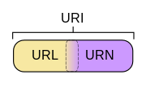

======================
1. 爬虫基础
======================

 ————如果把互联网比作成一张大网，那么爬虫就是获取到网页提取并保存其中的信息的自动化 **程序** 

在认识爬虫之前，还需要具备的一些基础的网络知识

--------------------------------------------------------------------------------

HTTP和HTTPS
========================

在浏览器中网页的url开头中经常会见到http或者https。
http和https都是访问资源时需要的 **协议类型**，除此之外还有一些其他协议如：ftp、sftp、smb等

| HTTP：**超文本传输协议**。顾名思义，此协议是从网络传输超文本数据到本地浏览器的传送协议。
| HTTPS：以 **安全** 为目标的HTTP。在原有的HTTP下加入了SSL层，SSL加密的主要作用是：

1. 建立 **信息安全通道** 来保证数据传输的安全；
#. 确认网站的 **真实性**，凡是使用了HTTPS的网站，都可以通过点击浏览器地址栏的锁头标志查看网站认证之后的真实信息；
#. 有的网站虽然使用了HTTPS协议，但是还是会被浏览器显示不安全，是因为给此类网站颁发的CA证书不被CA机构信任。但是此类网站的信息的确也是经过SSL加密的；
#. 在爬取这类不受信的网站时，需要 **设置忽略证书** 的选项，否则会提示SSL链接错误。

--------------------------------------------------------------------------------

URI-URL-URN区别
========================

URI [Uniform Resource Identifier]

.. note::
   
   URI的全称为Uniform Resource Identifier，即 **统一资源标志符**。它是一个用于标识某一互联网资源名称的字符串。URI中包含了URL以及URN

URL [Universal Resource Locator]

.. note::
   
   URI全称为 **统一资源定位符**，URL是URI的一个子集，URL告诉我们访问网络位置的方式。所有的URL都是URI

URN [Universal Resource Name]

.. note::

   URN的全称为 **统一资源名称**，虽然URN在平时用的很少，但并不代表它没有任何意义。相反，它虽然不能够像URL那样给我指定资源的具体位置，但是它却能够唯一的指定资源的名称。例如书籍的ISBN码和产品在系统内的序列号

由上图可以很清晰的看出它们三者的关系：
    URL类似于住址，它告诉你一种寻找目标的方式。这个定义同时也是一个URI。 相对地，可以把一个人的名字看作是URN；因此可以用URN来唯一标识一个实体。由于可能存在同名的情况，所以更准确地说，人名这个例子并不是十分恰当。更为恰当的是书籍的ISBN码和产品在系统内的序列号，尽管没有告诉你用什么方式或者到什么地方去找到目标，但是你有足够的信息来检索到它。

--------------------------------------------------------------------------------

HTTP的请求过程
========================

  ————在浏览器地址栏输入url后到底发生了什么？

简单来讲，大致分为以下几步：

+ 在浏览器中输入一个URL并回车
+ 浏览器向此URL所指向网站所在的服务器发送了一个请求
+ 服务器接收到此请求后对请求进行处理和解析
+ 服务器返回对此请求的响应给浏览器
+ 响应里包含了页面的源代码等内容，浏览器对响应内容进行解析并将内容在网页中呈现

.. note::
   此处的浏览器就是本地客户端，上述的过程就是客户端和服务端交互的过程。

**请求 (Request)**
------------------------

请求一般分为以下几个部分：

 **1. 请求方法 (Request Method)**

常见的请求方法有两种：*GET*、*POST* ，它们的区别如下：

*GET* 请求中的参数包含在URL里面，**数据可以在URL中看到**。\
如百度搜索python的 *URL* 为：https://www.baidu.com/s?wd=python , *GET* 的参数能够在URL中看到
*POST* 请求的 *URL* 不会包含这些数据，*POST* 的数据都是通过表单形式传输的，其会包含在请求体中。
*GET* 请求的参数由于是包含在URL中，所以它有最大长度(1024字节)。
而 *POST* 方式由于表单提交所以没有大小限制在遇到需要提交敏感信息或者是上传大文件时最好采用 *POST* 方法。

 **2. 请求的网址 (Request URL)**

请求的网址，即URL，它能够唯一确定我们想请求的资源

 **3. 请求头 (Request Headers)**

+ Accept：请求报头域，用于指定客户端可接受哪些类型的信息
+ Accept-Language：指定客户端可接受的语言类型
+ Accept-Encoding：指定客户端可接受的内容编码
+ Host：用于指定请求资源的主机IP和端口号，其内容为请求URL的原始服务器或网管的位置。
+ Cookies：网站为了辨别用户进行会话跟踪而存储在用户本地的数据。*Cookies* 的主要功能是 **维持当前访问会话**。
  Cooikes中有信息标识了所对应的服务器的会话，每次浏览器在请求该站点的页面时，都会在请求头中加上Cooikes并将其发送给服务器，
  这样服务器才能够通过Cooikes识别出到底是谁。
+ Referer：标识请求是从哪个页面发出
+ User-Agent：使服务器识别客户使用的操作系统及版本、浏览器及版本等信息。爬虫时加上此信息可以伪装成浏览器。
+ Content-Type：表示具体请求中的媒体类型信息。例如text/html表示HTML格式，image/gif表示GIF图片

例如登录某些需要用户名和密码的网站，提交这些内容时就会以表单数据的形式提交给服务器。以什么形式提交数据与上述的请求头中的Content-Type
息息相关。

.. centered:: 表1.1 Content-Type 和 POST提交数据方式的关系
===================================== ====================
Content-Type                          提交数据的方式
===================================== ====================
application/x-www-form-urlencoded     表单数据
application/form-data                 表单文件上传
application/json                      序列化JSON数据
text/xml                              XML数据
===================================== ====================

 **4. 请求体 (Request Body)**

请求体中的内容通常是 *POST* 请求中的表单数据，而对于 *GET* 请求，请求体则为空。因为 *GET* 请求的参数都在 *URL* 中。

**响应 (Response)**
------------------------

响应由服务器返回给客户端，其可由以下三部分组成：

 1. 响应状态码 (Response Status Code)

响应状态码表示服务器的响应状态，下表列出了常见多状态码及其说明

.. centered:: 表1.2 常见错误状态码及其原因
====== ==================== ===============================================
状态码  说 明                详 情
====== ==================== ===============================================
200    成功                  服务器成功处理了请求
301    永久重定向            请求的网页永久移动到新的位置
302    临时重定向            请求的网页暂时跳转到其他页面
403    禁止访问              服务器收到请求但拒绝处理此请求
404    页面未找到            服务器找不到请求的页面
500    服务器内部错误        服务器遇到错误，无法完成请求
502    错误网关(Bad Gate)    服务器作为网关或代理，从上游服务器收到无效响应
503    服务不可用            服务器目前无法使用             
504    网关超时              服务器作为网关或代理，没有及时从上游服务器收到请求
====== ==================== ===============================================

 2. 响应头 (Response Headers)

+ Date：标识响应 **产生的时间**
+ Last-Modified：指定资源的 **最后修改时间**
+ Content-Encoding：指定响应内容的 **编码**
+ Server：包含服务器的信息，比如名称、版本号等信息
+ Content-Type：文档类型，指定返回的数据类型是什么，和请求头中的功能类似
+ Set-Cookies：响应头中的此内容告诉浏览器需要将此内容放在Cooikes中，下次请求时需携带此Cooikes请求
+ Expires：指定响应的过期时间，可以使代理服务器或浏览器将加载的内容更新到缓存中，如果再次访问，直接从缓存中加载，降低服务器负载，缩短加载时间

 3. 响应体 (Response Body)

响应的正文数据都在响应体中，所以最重要的当属响应体中的内容。
爬虫请求网页后要解析的内容就是响应体。可以在浏览器的开发者工具中选择Preview查看响应体的内容

在爬虫时，主要通过响应体得到网页的源代码、JSON数据等。然后从相应的内容提取。

--------------------------------------------------------------------------------

网页基础
========================

    ————为什么浏览器的打开网页显示会是这个样子？

**网页的组成**
------------------------

网页可以分为三大部分————HTML、CSS、JS

1. HTML：HTML语言全称为 Hyper Text Markup Language，即超文本标记语言。网页中的所有元素，基础架构都是HTML。不同类型的元素由不同的标签来表示。正是由于各种标签通过不同的排列和嵌套最后才形成了网页的框架
2. CSS: CSS全称为 Cascading Style Sheets,即层叠样式表。为什么叫做'层叠'是指当HTML中引用了数个样式文件，并且发生冲突时，浏览器能够依据层叠顺序处理。CSS是目前唯一的网页页面排版样式标准   
3. JS: 全称为JavaScript，是一种脚本语言。它能够给页面提供交互和动画效果。如下载进度条、提示框、轮播图等

综上所述，HTML定义了网页的内容和结构，CSS描述的网页的布局，JS定义了网页的行为。如果把网页比作一个人的话，那么HTML就好比是骨架，CSS犹如身上的肌肉和衣服，JS就是描述这个人的行为。

Demo html ::

  <!DOCTYPE html>
  <html>
    <head>
      <meta charset='UTF-8'>
      <title>This is a demo web</title>
    </head>
    <body>
      

        

          <h2>Hello world!</h2>
          
This is paragraph.

        

      

    </body>
  </html>

上述是一个简单的HTML代码实例。开头用 ``<!DOCTYPE html>`` 定义文档的类型为html。其次是最外层需要用 ``<html>`` 和 ``</html>`` 将所有标签包含进来。
同时在内部分别定义了 ``<head>`` 和 ``<body>`` 标签。代表网页头和网页体，在网页头中定义了页面的编码方式为 *UTF-8*，同时给页面设定了一个title。此标题是显示在浏览器的页面选项卡中
除此之外还可以在网页头中引入外部的js文件或者css文件(你也可以在body中引入该文件，好处是网页HTML加载完成后再进行渲染)

此外，在上述代码中的 ``div`` 标签中还定义了 ``id`` 和 ``class`` 。通过 ``id`` 的值能够唯一的确定页面中的这个 ``div`` 区块，而 ``class`` 的值则是能确定一类名称一致的区块。灵活配合CSS能够设定区块的样式。
  
更多前端知识建议参考：
   `W3C-HTML教程 <https://www.w3.org/community/webed/wiki/HTML/Training>`_ 、 `MDN-HTML教程 <https://developer.mozilla.org/zh-CN/docs/Learn/HTML>`_

**HTML DOM**
------------------------

在HTML中，所有的标签定义的内容都是节点，它们共同构成了一个HTML DOM树型结构。如下所示：

.. image:: ./html_dom.gif

在理解之前首先要知道什么是DOM？ 

.. note::
  DOM(Document Object Model),即文档对象模型。

  DOM 是 W3C（万维网联盟）的标准，它定义了访问 HTML 和 XML 文档的标准：
   W3C 文档对象模型(DOM)是中立于 **平台** 和 **语言** 的接口，它允许 **程序** 和 **脚本** 动态地访问和更新文档的内容、结构和样式。

  W3C DOM 标准被分为 3 个不同的部分：
   #. 核心 DOM —— 针对任何结构化文档的标准模型
   #. XML DOM —— 针对 XML 文档的标准模型
   #. HTML DOM —— 针对 HTML 文档的标准模型

通过HTML DOM,上图中的所有节点都可以通过JavaScript访问。所有的节点元素均可被修改、创建和删除。
同时节点与节点之间还具有层级关系：
 
 #. 父节点 —— 父节点拥有子节点
 #. 子节点 —— 任何除根节点外的节点都是其上级节点的子节点
 #. 兄弟节点 ——— 同级节点称为兄弟节点

**CSS选择器**
------------------------

网页是由一个一个节点构成的，CSS选择器会根据不同的节点设置不同的样式规则。

.. centered:: 表1.3 部分CSS选择器定位规则
============ ==================== ===============================================
选择器        例 子                描 述
============ ==================== ===============================================
``.``        ``.abc``             选择 *class='abc'* 的所有节点
``.``        ``div .abc``         选择 *class='abc'* 的所有名为div的节点
``#``        ``#abc``             选择 *id='abc'* 的所有节点
``*``        ``*``                选择所有节点
空           ``p``                选择所有的p节点
空,空        ``div,p``            选择所有的div节点和的p节点
空 空        ``div p``            选择所有的div节点中的p节点
空>空        ``div>p``            选择所有父节点为div节点的p节点
空+空        ``div+p``            选择所有紧接着
节点之后的
节点
[属性]       ``[target]``         选择所有带有target属性的节点
============ ==================== ===============================================

 ————全部CSS选择器表请参考 `CSS选择器参考手册 <http://www.w3school.com.cn/cssref/css_selectors.ASP>`_

--------------------------------------------------------------------------------

爬虫的基本原理
========================

正如前述所说，互联网就好比一张铺开的大网。各种信息交织在一起。爬虫便是能够自动的将我们所需要的信息快速且高效的抓取下来

**爬虫的步骤**
------------------

**1. 获取网页**

 这是爬虫首先要做的事情————获取网页的源代码。向URL网页所在的服务器发送一个请求，返回的响应体便是网页的源代码。
 爬虫就是利用这个过程，构造一个请求发送给服务器，然后接收到响应并将其解析。

如何用Python实现：

.. note::
 在python中提供了很多库来帮助我们实现上述操作，如：urllib、request等。
 我们可以利用这些库实现HTTP的请求操作。请求和响应的接收都有库帮助我们完成。
 最后通过特定的方法获取到网页的源代码，这样就能够通过程序的手段实现获取网页的过程。

.. warning::

   有时利用urllib、request抓取网页时，获得的源代码和实际在浏览器中的看到的不一样。这是由于网页越来越多的利用Ajax异步刷新、前端模块化工具来构建，
   整个网页可能都是由JS渲染出来的。此时HTML代码完全就是一个空壳，所有的内容都是由JavaScript去执行HTML代码中引入的JS文件运行得到的。针对此类情况就可以通过分析其后台的Ajax接口，
   或是利用Selenium、Splash这样的库来实现模拟JavaScript渲染。

**2. 提取信息**

 获取到网页源代码后就是分析源代码，定位并提取到我们需要的信息。由于源代码中除了含有我们所需的信息外还含有HTML标签元素等干扰项，通用的办法是利用正则表达式，但是正则表达式在构造时容易出错，且比较复杂。

 别急，Python提供了一些库来帮助我们，比如：Beautiful Soup、pyquery、lxml等。使用这些库能够使我们快速地从中提取网页信息，如节点的属性，文本值等。
 python的魅力正是如此，如此丰富的武器库能够让我们达到快速开发的目的。
 
.. note::

  提取信息是爬虫中十分重要的步骤，它能够使杂乱无章的数据变的条理清晰

**3. 保存数据**

 提取到信息后，通常会将信息保存到某处以便后续使用。保存的形式有很多：
  + 简单保存为TXT文本或JSON文本 
  + 保存到数据库中
  + 保存到远程服务器
  + ...

**4. 自动化程序**

 自动化获取信息就是我们爬虫的终极目标，虽然能够用人工的方法获取到信息，但是由于信息量的枯燥和繁杂，就需要借助到自动化程序能够帮助我们完成此类工作
 
 .. note::
  我们可以在程序中添加各种异常处理，错误重试，反爬等操作，使爬取能够高效的完成预期工作。

--------------------------------------------------------------------------------

Session和Cookies
========================

 ————在浏览网站的过程中，经常会遇到需要登录的时候，有的网站甚至只有登录后才能够访问，在登陆后我们可以连续访问很多次网站。\
 但是再过一段时间就需要再次登录才能访问。这是为什么呢？

 在此之前，还需要了解一下其他的知识，这样能够方便理解Session和Cookies

**静态网页与动态网页**
---------------------

 * 静态网页 —— 内容已经被写死的网页，优点是加载速度快，编写简单；缺点是可维护性差，不能根据URL灵活地显示内容。
 * 动态网页 —— 动态解析URL中的参数并与数据库交互，用户的登录和注册操作就是依据动态网站来实现的

.. note::
 在上面提到的登录操作，就是在用户登录后拿到了能够唯一对应该用户的凭证。这样才能够在登录后的一段时间里保持用户的登录状态。
 不过这个凭证到底是什么？其实它就是Session和Cookies共同产生的结果!

**Session和Cookies原理**
--------------------------

在了解其原理之前，我们必须知道HTTP的一个特点——HTTP的无状态

.. note::
 HTTP的无状态是指HTTP协议对事务处理是没有记忆的，服务器不知道客户端是什么状态。每一次向服务器发送请求，服务器收到请求并解析再返回对应的响应，这整个过程是完全独立的。
 服务器不会记录前后状态的变化。

这意味着 **如果后续需要处理前面的信息，则必须重传** 。但是这样重复性的工作肯定不是我想要的。

因此，Session(会话)和Cookies这两个用于保持HTTP连接状态的技术就应运而生了。
 1. Session在服务端，用来保存用户的会话信息
 2. Cookies在客户端，在发送请求时被附带上，用来识别用户身份
正是由于这两个技术的存在，才使得我们能够在登录到某一网站后继续访问网站的其他页面而不需要再次验证登录

什么是Session(会话)：

.. note::
 会话本是指 **有始有终** 的一系列动作或消息。例如：街上的两人从刚碰头聊天到刚结束分开这个过程就可以理解为一个会话。
 
 在web中，会话对象(Session)用来存储特定用户所需的属性以及配置信息。这样，当某个用户在网站的web之间跳转时，存储在会话中的变量\
 并不会丢失，而是在整个用户会话中一直存在下去。当用户请求某网站的web时还没有会话，这服务器将自动给用户创建一个会话对象。当会话过期或被放弃后则终止此对话。

什么是Cookies：

.. note::
 Cookies是浏览器储存在用户电脑上的一小段文本文件。一个WEB页面或服务器，来告知浏览器按照一定规范来储存这些信息，并在随后的请求中将这些信息发送至服务器。
Cookie通常用来识别不同的用户。

**会话维持**
-------------------------

如何利用Session和Cookies来保持状态呢？
 当客户端 **第一次** 向服务器发出请求时，服务器会在响应头中返回一个Set-Cookies字段给客户端，此Cooikes用来标记用户身份。客户端会将\
 Cooikes保存起来。当客户端下一次再次请求该网站时会把此Cooikes放到请求头(Request-Headers)中一起提交给服务器。

 由于Cooikes中携带了会话ID信息，那么服务器就可以通过Cooikes找到对应的Session所在，然后再判断会话的信息来辨认用户的状态。
 反之，如果客户端传给服务器的Cooikes是无效的或者Session已过期了。我们将不能够继续访问此网站，而需要重新登录。

综上，只有Cooikes和Session相互配合，一个处于客户端(Cooikes)，一个处于服务端(Session)，二者共同协作，就能够实现会话控制。

**Cooikes属性结构**
-------------------------
 
 Cooikes具有以下几个属性：
  1. Name —— Cooikes的名称，一旦创建不可修改
  2. Value —— Cooikes值，如果值为Unicode字符，则需要为字符编码。如果值为二进制数据，则需要使用BASE64编码
  3. Domain —— 可以访问该Cooikes的域名。
  4. Max Age —— Cooikes失效时间，单位为秒。常和Expires一起使用，通过它可以计算出其有效时间。如果Max Age值为正数则为失效秒数，如果为负数则表示关闭浏览器时Cooikes即失效。
  5. Path —— Cooikes的使用路径，如果设置为/Path/，则只有在路径为/Path/下的页面可以访问该Cooikes，如果设置为/，则本域名下的所有页面都能够访问该Cooikes
  6. Size —— Cooikes的大小
  7. HTTP字段 —— Cooikes的httponly属性。如果此属性为True，则只能在HTTP协议头中会带有此Cooikes的信息，而不能通过document.cooike 来访问此Cooikes
  8. Secure —— 该Cooikes是否仅被使用安全协议传输。此字段默认为False
 
`Session\Cooikes知识参考 <https://zhuanlan.zhihu.com/p/27669892>`_